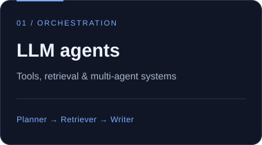
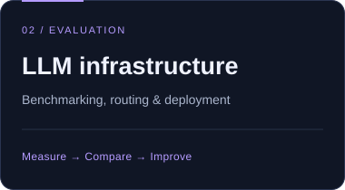
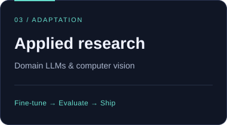

<!-- ═══════════════════════════════ HEADER ═══════════════════════════════ -->
<h1 align="center">Tahsin Soyak</h1>
<h3 align="center">🤖 AI/ML Engineer & Researcher · İstanbul, Turkey</h3>

<!-- Animated typing subtitle -->

<!-- Profile stats -->

 

<!-- Connect buttons -->

 

<!-- ═══════════════════════════════ PILLARS ═══════════════════════════════ -->

  
  
  

---

## About Me

I am an **AI/ML Engineer & Researcher** based in İstanbul, turning large language models and computer vision research into high-availability production systems.

- **AI Engineer @ DT Cloud:** Building autonomous LLM agents (planner / retriever / writer / evaluator), an end-to-end **LLM Benchmark Platform for Türkiye's Defense Industries Agency (SSB)**, and self-hosted multi-agent (A2A) architectures.
- **MSc in Computer Engineering (GPA 3.96 / 4.00):** Thesis on *Fine-Tuning Large Language Models for Turkish Agriculture*.
- **TÜBİTAK Research Project:** Fine-tuned Google **Gemma** with LoRA/PEFT, successfully passing benchmark-driven milestone evaluations.
- **Published IEEE Researcher:** Computer vision & applied ML · 6× Academic Honour Certificate recipient · Former Microsoft Student Ambassador.
- Open to research collaborations and discussions on **LLM agent swarms, evaluation harnesses, and domain fine-tuning**.

[Browse all repositories →](https://github.com/tahsinsoyak?tab=repositories) &nbsp;·&nbsp; [Read my articles on Medium →](https://medium.com/@tahsinsoyakk)

## Tech Stack

- **AI & Models:** `Python` · `PyTorch` · `TensorFlow` · `LangChain` · `LiteLLM` · `Hugging Face` · `OpenCV`
- **Backend & Systems:** `FastAPI` · `Django` · `Docker` · `Redis` · `Celery` · `PostgreSQL`
- **Architectures & Methods:** `RAG` · `LoRA / PEFT Fine-Tuning` · `A2A Multi-Agent Swarms` · `Qdrant / Chroma` · `Benchmarking (EM/F1)`

## Experience

- **AI Engineer** · **DT Cloud** `Jun 2025 - Present · İstanbul`  
  Architected the LLM Benchmark Platform for **SSB** (Türkiye's Defense Industries Agency) using Django, LiteLLM, and Redis/Celery. Built self-hosted **A2A multi-agent platforms** with latency/cost-aware routing. Fine-tuned **Gemma (LoRA/PEFT)** for agricultural intelligence under a **TÜBİTAK** grant.
- **R&D Engineer** · **Mirsis Information Technologies** `Sep 2023 - Jun 2025 · İstanbul`  
  Engineered transformer-based **CV parsing** for an intelligent recruitment platform, migrating legacy NLP into fine-tuned LLM services in Django.
- **Founder & Captain** · **Familiar** `Nov 2022 - Present`  
  Built meeting summarizers, content generation assistants, and medical-imaging classification pipelines (breast cancer and brain tumour).
- **Scientific Researcher** · **University of Groningen** `Aug 2023 - Oct 2023 · Netherlands`  
  Engineered custom machine learning models and visualizations for scientific research publications.

## Research & Publications

- **IEEE (2025):** *[Strawberry Counting & Ripeness Detection on the Web](https://ieeexplore.ieee.org/document/11017268)* (Real-time web computer vision pipeline)
- **MSc Thesis (GPA 3.96 / 4.00):** *Fine-Tuning Large Language Models for Turkish Agriculture* (TÜBİTAK funded)
- **Applied ML (2023):** *Song Popularity Classification Using the Spotify Dataset*

<b>Verified Certifications (Click to expand)</b>

 

- **Agents & Retrieval:** Hugging Face (MCP · AI Agents) · NVIDIA (RAG Agents) · LangChain (Chat with Your Data)
- **Models & NLP:** Google (Gemini Multimodal) · DeepLearning.AI (Fine-tuning LLMs · NLP in TensorFlow)
- **ML & Edge:** Stanford (Machine Learning Specialization) · IBM (ML with Python) · NVIDIA (Jetson Nano)

## 📊 GitHub Analytics

## 🏅 Leadership & 🌍 Languages

- 🧠 **Founder & President:** AI Society, Yozgat Bozok University · 🎤 **Microsoft Student Ambassador** · 🏆 **6× Academic Honour Certificate** recipient
- 🌍 **Languages:** 🇹🇷 Turkish `Native` · 🇬🇧 English `Fluent` · 🇳🇱 Dutch `Elementary` · 🇩🇪 German `Elementary`

---

### Contact

Looking to collaborate on agent systems, fine-tuning, or production LLM infrastructure?

Thanks for visiting! Feel free to star the repos or connect.

